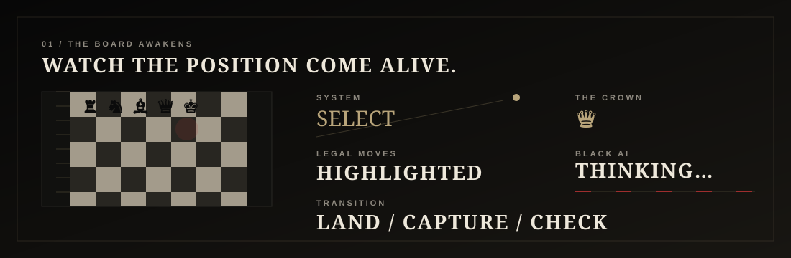
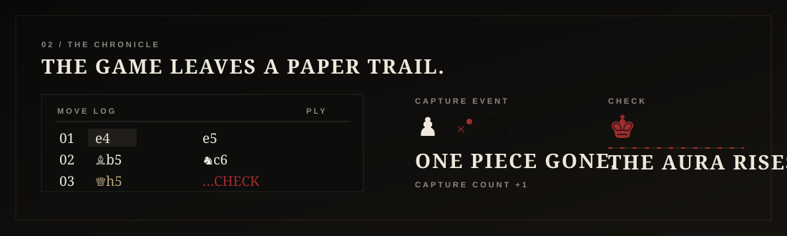
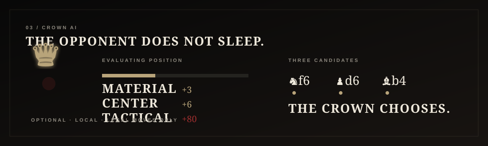

# ♛ THE BLACK CROWN

> **Every square is a throne. Take one.**
>
> A gothic chess arena designed to feel less like a utility and more like a game discovered in a haunted archive.

<p align="center">
  
</p>

<div align="center">

**[PLAY THE ARENA](https://github.com/gODtECH-Ctl-Create/THE-BLACK-CROWN)** · **[OPEN THE CODE](https://github.com/gODtECH-Ctl-Create/THE-BLACK-CROWN/tree/main)** · **[VIEW THE BUILD PR](https://github.com/gODtECH-Ctl-Create/THE-BLACK-CROWN/pull/1)**

</div>

---

## The first scene

The Black Crown is not trying to be another clean, friendly chess widget.

It is a **browser-first chess experience** with theatrical motion, archival typography, a dark material palette and a board that behaves like the central artifact of the page.

The interface is intentionally built around the feeling of **watching a game happen**, not filling out a dashboard.

## Watch the systems move

### I. The board awakens

<p align="center"></p>

A click selects a piece. The board immediately reveals legal targets. Moving a piece creates a landing beat. A capture gets its own visual and audio cue. A checked king gets an aura instead of a tiny status label buried somewhere on the screen.

### II. The chronicle remembers

<p align="center"></p>

Every move becomes part of the chronicle. Captures remain visible. The latest move is highlighted. The board state is always inspectable. The idea is simple: **the game should leave evidence behind.**

### III. The Crown thinks

<p align="center"></p>

The optional Black opponent uses a lightweight heuristic over legal moves, considering material, central squares and tactical signals. It is deliberately transparent and easy to replace with a stronger engine later.

**AI** means **Artificial Intelligence**.

---

## What is alive right now

| System | Experience |
| --- | --- |
| ♟ **Real chess rules** | Legal moves, check, checkmate, draws, castling, promotion, en passant and history are delegated to Chess.js. |
| ♛ **Crown AI** | Optional Black opponent with a small tactical heuristic. |
| ◈ **Move theatre** | Selected squares, legal targets, captures, check aura and piece landing animation. |
| ◌ **The Chronicle** | Move log, captured pieces, checks, captures and current board state. |
| ↻ **Board flip** | Swap player orientation without restarting the game. |
| ⌂ **Local memory** | The current position survives refresh through browser storage. |
| ◒ **Atmosphere** | Grain, dust, vignette, typography, shadows and Web Audio move cues. |
| 📱 **Responsive UI** | The composition collapses cleanly for smaller screens instead of shrinking everything into unusable controls. |

---

## The architecture

```text
                         THE BLACK CROWN
                                │
             ┌──────────────────┴──────────────────┐
             │                                     │
        PRESENTATION                           GAME CORE
     index.html + CSS                            app.js
             │                                     │
      ┌──────┼──────┐                 ┌───────────┼───────────┐
      ▼      ▼      ▼                 ▼           ▼           ▼
   layout  motion  mood            Chess.js   local state   audio
                                        │
                                        ▼
                               legal position state
```

The initial implementation deliberately avoids a server and framework overhead. The game is a static site with a real chess rules engine loaded as a pinned **ECMAScript Module (ESM)**.

The saved position is represented using **Forsyth-Edwards Notation (FEN)**, a compact standard notation for describing a chess position.

That architecture leaves a clean seam for the next generation: multiplayer rooms, authoritative server validation, profiles, spectators and replay.

---

## Run it locally

```bash
git clone https://github.com/gODtECH-Ctl-Create/THE-BLACK-CROWN.git
cd THE-BLACK-CROWN
python3 -m http.server 4173
```

Open `http://localhost:4173`.

A static server is recommended because the browser loads the chess engine as an ECMAScript Module.

---

## Project map

```text
THE-BLACK-CROWN/
├── index.html
├── styles.css
├── app.js
├── favicon.svg
├── assets/
│   ├── black-crown-demo.svg
│   ├── 01-board-awakens.svg
│   ├── 02-chronicle.svg
│   └── 03-crown-ai.svg
└── .github/
    └── workflows/
        └── deploy-pages.yml
```

---

## Design doctrine

**The board wins.** The surrounding UI exists to frame the decision, not fight it.

**Motion has meaning.** A hover, move, capture, check and checkmate should not all feel like the same animation.

**Information feels discovered.** The move log is a chronicle. Player state is a ritual. Captures are evidence.

**Darkness has texture.** The palette uses warm paper tones, muted metal, restrained red and layered shadows instead of generic black gradients.

**The interface is a stage.** On mobile, desktop and future multiplayer screens, the goal remains the same: make the person feel that something important is happening on the board.

---

## The roadmap

### Act II — make the game dangerous

- drag-and-drop movement with tactile transitions
- real promotion choice modal
- chess clock with pressure states
- stronger Crown AI with difficulty personalities
- opening recognition
- replay mode with cinematic move playback
- named local game saves

### Act III — build the arena

- online rooms
- private match links
- friend invites
- spectator mode
- reconnect and resume
- persistent player profiles
- server-authoritative validation

### Act IV — build the mythology

- multiple board materials and piece sets
- reactive soundscape
- achievements and match history
- opening repertoire
- cinematic checkmate sequences
- shareable game stories
- animated replay exports for documentation and social content

---

## Status

**Foundation build · playable · under active development**

The repository began as a one-line README. The first build now establishes the game shell, responsive UI, chess interaction layer, local persistence, optional Artificial Intelligence opponent, animated README storytelling and a GitHub Pages deployment path. The current work lives in **PR #1** so the foundation can be reviewed before it reaches `main`.

> **Built for experimentation. Designed to grow teeth.**
