# ♛ THE BLACK CROWN

> **Every square is a throne. Take one.**
>
> A gothic chess arena designed to feel less like a utility and more like a game discovered in a haunted archive.

<p align="center">
  
</p>

<div align="center">

**[PLAY THE ARENA](../../)** · **[WATCH THE SOURCE](../../tree/main)**

</div>

---

## The idea

**THE BLACK CROWN** is a browser-first chess experience with a deliberately theatrical interface. The board is the hero. The interface behaves like a chronicle around it: players, captures, moves, state, and the little moments that make a game feel alive.

The first build is intentionally dependency-light: a static frontend, a real chess rules engine loaded from a pinned browser module, and browser storage for local persistence.

### What is already alive

| System | What it does |
| --- | --- |
| ♟ **Real chess** | Legal moves, check, checkmate, draws, castling, promotion, en passant and move history are handled by the chess engine. |
| ♛ **Crown AI** | Optional Black opponent that chooses legal moves using a lightweight material, center-control and tactical heuristic. AI means **Artificial Intelligence**. |
| ◈ **Move theatre** | Selected squares, legal targets, captures, check states and landing animations turn every move into a visible event. |
| ◌ **The Chronicle** | Move log, captured pieces, checks, captures and board state stay visible beside the board. |
| ↻ **Orientation** | Flip the board instantly without losing the game. |
| ⌂ **Local memory** | The current game is restored from browser local storage after a refresh. |
| ◒ **Atmosphere** | Grain, dust, vignette, tiny sound cues and a restrained gothic palette build the world around the game. |

---

## The visual language

The design is built around four rules:

**1. The board wins.** Nothing competes with it for attention.

**2. Information feels discovered.** The move log and player state are treated like archival notes, not dashboard widgets.

**3. Motion has meaning.** A piece landing, a capture, a check or a game ending should feel different.

**4. Darkness is a material, not just a color.** Grain, shadows, restrained gold, muted paper tones and small red accents create depth without turning the board into a neon game interface.

---

## How the pieces fit together

```text
┌─────────────────────────────────────────────┐
│                 THE BLACK CROWN              │
├─────────────────────────────────────────────┤
│                                             │
│  UI / Atmosphere                            │
│  index.html + styles.css                   │
│           │                                 │
│           ▼                                 │
│  Interaction layer                         │
│  app.js                                    │
│     │          │             │              │
│     ▼          ▼             ▼              │
│  Chess.js   Local Save    Web Audio         │
│  rules      FEN state     move cues         │
│                                             │
└─────────────────────────────────────────────┘
```

**FEN** means **Forsyth-Edwards Notation**, the compact string used here to preserve the current board position.

There is no application server in this first foundation pass. That keeps the prototype easy to deploy, easy to inspect and easy to evolve into a richer multiplayer system later.

---

## Run it

Because the project is static, you can open `index.html` with a local static server.

```bash
git clone https://github.com/gODtECH-Ctl-Create/THE-BLACK-CROWN.git
cd THE-BLACK-CROWN
python3 -m http.server 4173
```

Then open:

```text
http://localhost:4173
```

A static server is recommended because the chess engine is imported as an **ECMAScript Module (ESM)**.

---

## Project map

```text
THE-BLACK-CROWN/
├── index.html
├── styles.css
├── app.js
├── assets/
│   └── black-crown-demo.svg
└── .github/
    └── workflows/
        └── deploy-pages.yml
```

---

## What comes next

The foundation is deliberately small so the next layer can be ambitious without fighting a throwaway architecture.

### Act II — make the game feel dangerous

- proper drag-and-drop piece movement
- promotion choice modal instead of automatic queen promotion
- richer capture and check animations
- clock system with dramatic time states
- opening names and game metadata
- save/load named games
- replay mode that can literally play the match back in the README/demo style

### Act III — build the arena

- online rooms
- friend invites
- spectators
- persistent player profiles
- game links that reconstruct a position
- server-authoritative move validation
- reconnect and resume support

### Act IV — crown the experience

- stronger engine opponent
- difficulty personalities
- opening repertoire
- thematic boards and piece sets
- achievements and match history
- soundscape and reactive ambience
- cinematic game-over sequences

The important part: **the current board is already a real game, not a mockup.**

---

## Status

**Foundation build — playable.**

The repository started as a one-line README. This pass establishes the actual game shell, chess interaction layer, atmosphere, persistence, an optional Artificial Intelligence opponent, an animated repository preview and GitHub Pages deployment.

Built for experimentation. Designed to grow teeth.
